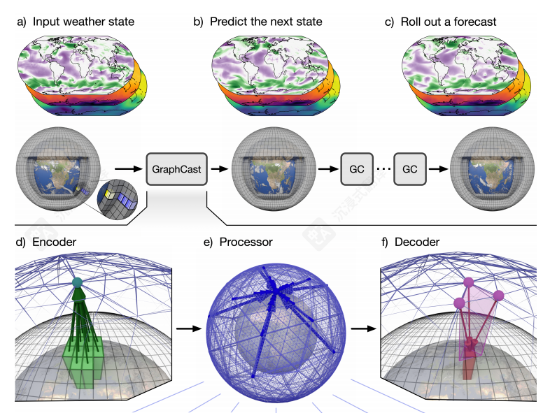
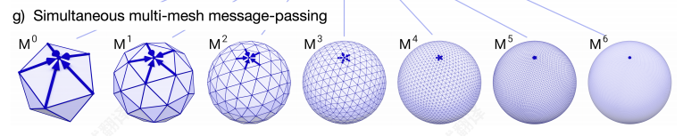
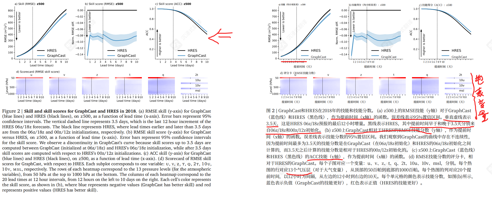
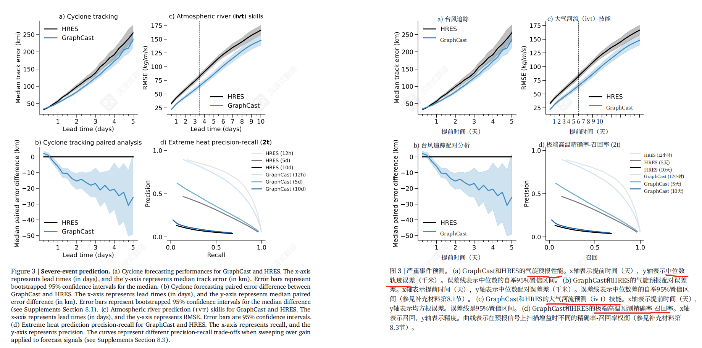

# 《GraphCast: Learning skillful medium-range global weather forecasting》
[GraphCast: 基于图神经网络的全球中期天气预报](https://arxiv.org/abs/2212.12794)

## 1. 核心创新点

- **数据驱动方法**：直接从历史再分析数据（ERA5）训练，无需依赖物理方程
- **高效预测**：在单个TPU v4设备上1分钟内完成10天全球天气预报
- **高分辨率**：0.25°经纬度分辨率（约28km），覆盖全球
- **多变量预测**：同时预测数百个天气变量，包括地表和大气变量
- **性能优势**：在90%的验证目标上超越最准确的业务确定性预报系统（ECMWF HRES）

## 2. GNN架构与数据处理

### 输入数据
- **时间维度**：当前时刻 + 6小时前的两个天气状态
- **空间分辨率**：0.25°网格（721×1440个点）
- **变量类型**：
  - 地表变量（5个）：2米温度、10米风分量、平均海平面气压等
  - 大气变量（6个）：温度、风分量、位势、比湿等，分布在37个气压层

### GNN处理流程（编码-处理-解码架构）


#### 编码器（Encoder）
- 单层GNN，将经纬度网格数据映射到内部多网格表示
- 输入变量归一化为零均值单位方差

#### 多网格（Multi-Mesh）



- 基于**正二十面体**递归细分6次生成（M0->M6）
- 每次细化将每个三角形分为四个更小的三角形（导致面和边增加四倍），并将节点重新投影到球体上
- M6包含40,962个节点，具有空间均匀性，包含中间图中创建的所有不同长度的边的并集，形成扁平层次结构。
- 在不同网格的边上的学习到的消息传递是同时发生的，以便每个节点都由其所有入边更新
```
正二十面体：正二十面体是所有柏拉图立体中最接近球体的多面体，具有很好的对称性质，网格点分布均匀。
具体计算方式：

初始：节点数V0=12，面数F0=20，边数E0=30。

每次细化，每个三角形变成4个，所以面数 F_{n} = F_{n-1} * 4。

节点数：每次细化，在每条边的中点添加一个新节点，同时原来的节点保留。因此，新节点数等于边的数量。所以，V_{n} = V_{n-1} + E_{n-1}。

边数：每次细化，原来的每条边会被分成两条，同时每个面会新增3条边（每个三角形被分成4个小三角形，原来3条边变成6条，但每条边被两个三角形共享，所以每个面实际增加3条边？）实际上，更简单的计算是：每个面被分成4个，每个新面有3条边，但每条边被两个面共享，所以总边数 E_{n} = (F_{n} * 3) / 2。
```
#### 处理器（Processor）
- 16个独立的GNN层
- 在多网格上进行消息传递
- 实现高效的局部和远程信息传播

#### 解码器（Decoder）
- 单层GNN，将多网格特征映射回经纬度网格
- 预测对最近输入状态的残差更新

#### 训练细节

- **数据**：1979-2017年ERA5再分析数据
- **目标函数**：垂直层加权的均方误差（MSE）
- **训练策略**：自回归步数从1逐步增加到12（6小时到3天）
- **硬件**：32个TPU v4，训练时间约4周

好的，我来为您补充总结这些关键部分。

## 4. 验证方法

核心技能指标：
- RMSE：衡量预报值与真实值之间的绝对误差
- ACC：衡量预报异常场与真实异常场之间的空间相关程度
  
评估变量：在GraphCast在每个网格点预测的227个变量和层级组合中，对其中的69个与HRES进行了技能评估，对应WeatherBench的13个层级和ECMWF Scorecard 中的变量；补充材料第7节提供了进一步的详细评估，包括其他变量、区域性能、纬度和气压层效应、频谱特性、模糊化、与其他基于机器学习的预报的比较

**双重基准**：
- **WeatherBench**：作为AI模型的“标准考试”，确保与同类研究可比
- **ECMWF Scorecard**：作为业务预报的“黄金标准”，直接挑战最强者

**GraphCast vs HRES**
- **公平的“真实值”选择**：将 HRES 预报与ERA5 进行评估会在初始预报步骤上产生非零误差

| 模型 | 使用的真实值 | 选择理由 |
|------|-------------|----------|
| **GraphCast** | **ERA5再分析数据** | GraphCast的训练目标就是模拟ERA5的演变 |
| **HRES** | **HRES-fc0**（HRES 预报在未来初始化时的输入） | 避免因数据同化系统差异导致的初始误差 |


### 数据同化窗口对齐：

**时间初始化选择：**
- 仅使用**06z和18z**初始化时间
- 确保双方输入数据包含相同的"+3小时前瞻观测"

**避免的时间：**
- 不使用00z和12z初始化
- 防止ERA5的"+9小时前瞻" vs HRES的"+3小时前瞻"不匹配

### 评估频率控制：
- 每**12小时**评估一次预报结果
- 确保真实值（ERA5和HRES-fc0）具有相同的"+3小时前瞻"

- **数据同化窗口对齐**：
  - 仅使用**06z和18z**初始化时间
  - 确保双方输入数据包含相同的“+3小时前瞻观测”
  - 每**12小时**评估一次，避免时间偏差

## 5. 预报验证结果



### 主要发现：
- **全面优势**：在**90.3%** 的1380个验证目标上超越HRES
- **统计显著**：在89.9%的目标上显著优于HRES (p ≤ 0.05)

### 关键指标表现：
- **z500（500 hPa位势高度）**：
  - RMSE技能得分提升约7%-14%
  - 在所有预报时效均表现更优

### 分层分析：
- **对流层**：表现极佳，排除50 hPa后优势目标升至**96.9%**
- **平流层**：50-100 hPa层是HRES相对优势区域，但气象意义相对较小

### 模糊化处理验证：
- 即使对HRES也进行最优模糊化处理后，GraphCast仍在**88.0%** 的目标上保持优势

### 与AI同行比较：                 
- 相较于当时最好的AI模型Pangu-Weather，在**99.2%** 的252个目标上表现更优

## 6. 严重事件预报结果


### 热带气旋路径预报
比较方法：
1. 目标：评估GraphCast预测热带气旋路径（轨迹） 的能力。
2. 方法：
- 输入：使用GraphCast预报出的各种气象变量（包括风场、气压场、位势高度场）。
- 核心工具：采用一个统一的、标准化的气旋追踪算法（基于ECMWF的协议），从预报场中自动识别和追踪气旋的移动路径。
- 结果：得到一条由GraphCast预报出的气旋轨迹。

3. 比较基准：
- HRES基准：不使用HRES的原始数据重新追踪，而是直接使用业务中发布的、存储在TIGGE档案中的官方气旋轨迹数据。这是全球公认的高质量基准。
- 验证真相：使用IBTrACS数据集作为“标准答案”。这是一个综合了全球各路气象中心最佳数据的、事后分析得出的最可靠的气旋轨迹记录。

4. 公平性保障：
- 比较范围：只比较那些GraphCast和HRES都成功预报出来的气旋。
- 检查项：他们还验证了两个模型的“真阳性率”（即**成功发现真实气旋的比例**）是相近的，这确保了上述比较策略是合理的。

5. 预报结果：
- **更低的中位数误差**：更低的轨迹误差，在整个预报时效内轨迹误差更小
- **统计显著改进**：在18小时至4.75天预报中，配对误差分析显示显著优势。
- 更长的有效预见期：在长达近5天的预报中保持显著优势，为应急响应留出了更宝贵的准备时间
- **实战价值**：可为防灾减灾提供更准确的决策依据

### 大气河预测
- **大气河**：大气河是大气中狭窄的区域，负责中纬度大部分的极向水汽输送，并在美国西海岸产生30%‑65%的年降水量。冷月最频繁
- **关键指标**：垂直积分水汽通量。可以从水平风速（u和v）和比湿度（q）的非线性组合中计算得出，而GraphCast可以预测这些值
- **区域**：北美西海岸和东太平洋冷季（10月至4月，冷季最频繁）评估
- **性能提升**：短期预报改进25%，长期预报仍保持10%优势

### 极端温度预报
- 评估模型预测极端高温（定义为超过当地历史气候前2% 的异常高温）的能力
- **评估方法**：使用**精确率-召回率曲线**，来全面衡量模型准确性和漏报率之间的综合表现。
- **结果**：
  - **12小时**：HRES稍优
  - **5-10天**：GraphCast明显更优
- **意义**：在具有实际决策意义的中期极端天气预警中表现更好

## 7. 训练数据时效性的影响

### 实验设计：
训练四个不同截止时间的GraphCast变体：
- GraphCast:<2018 (1979-2017)
- GraphCast:<2019 (1979-2018)  
- GraphCast:<2020 (1979-2019)
- GraphCast:<2021 (1979-2020)

### 关键发现：
- **持续改进**：使用更近期数据训练的模型，在2021年测试集上表现更好
- **适应变化**：能够捕获随时间变化的天气模式（如ENSO循环）和气候变化效应
- **实际意义**：可通过定期重新训练保持模型竞争力，适应变化的气候

## 8. 结论与展望

### 技术里程碑：
- **竞争力证明**：MLWP方法首次在准确性和效率上全面挑战传统数值预报
- **效率革命**：1分钟 vs 数小时，开辟了全新的应用场景

### 核心优势：
- **高效准确**：在保持高精度的同时实现数量级的速度提升
- **下游价值**：虽未专门训练，但在极端天气预报中展现出实用价值
- **持续进化**：可通过重新训练捕获气候变化信号

### 当前局限与未来方向：
- **确定性限制**：目前为单一确定性预报，缺乏不确定性量化
- **分辨率限制**：受训练数据和硬件限制，当前为0.25°/37层
- **未来方向**：
  - **概率预报**：建立集合预报系统，量化不确定性
  - **更高分辨率**：向0.1°/137层等业务标准迈进
  - **多领域拓展**：气候、生态、能源等复杂时空预测问题

### 行业定位：
**非替代，而是互补**：数据驱动的AI方法与传统物理模型将形成共生关系，共同推动气象科学进步。GraphCast标志着AI在复杂物理系统建模中迎来了转折点。
